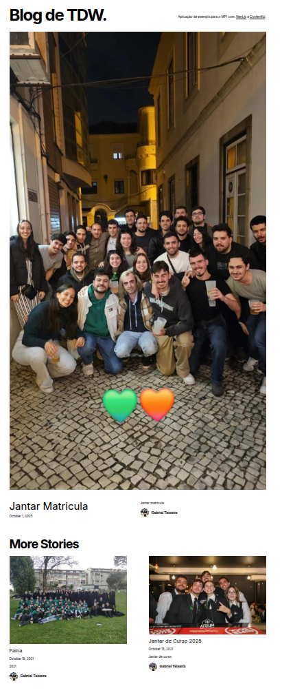

# TDW 1st Mini-Project - Gabriel Teixeira

## Status do Projeto

[](https://github.com/GabrielTeixei/tdw-mp1-Gabriel-Teixeira/actions/workflows/ci-cd.yml)

[](https://tdw-mp1-gabriel-teixeira.tdw-mctw.pt/)

**Deploy:** [Aceder ao Projeto](https://tdw-mp1-gabriel-teixeira.tdw-mctw.pt/)

---

## Sobre o Projeto

Blog estático desenvolvido com **Next.js** e **Contentful CMS**, com foco em:

- Geração estática de páginas (SSG)
- Integração com Contentful para gerenciamento de conteúdo dinâmico
- CI/CD automático com GitHub Actions
- Deploy contínuo no Netlify
- Design responsivo e código limpo seguindo boas práticas



---

## Funcionalidades

- Listagem de artigos com página inicial e paginação
- Visualização de posts individuais
- Conteúdo gerido via CMS headless (Contentful)
- Otimização automática de imagens
- Layout responsivo para desktop, tablet e mobile

---

## Tecnologias Utilizadas

| Categoria | Tecnologia | Descrição |
|------------|-------------|------------|
| Framework | [Next.js 14](https://nextjs.org/) | Framework React para geração de páginas estáticas com alto desempenho. |
| Linguagem | [TypeScript](https://www.typescriptlang.org/) | Tipagem estática para maior segurança e legibilidade do código. |
| CMS | [Contentful](https://www.contentful.com/) | CMS headless para gestão de conteúdo via API. |
| CI/CD | [GitHub Actions](https://github.com/features/actions) | Automatiza testes, builds e deploy contínuo. |
| Deploy | [Netlify](https://www.netlify.com/) | Hospedagem e deploy contínuo integrado com GitHub. |
| Estilos | [Tailwind CSS](https://tailwindcss.com/) | Framework CSS utilitário para layouts rápidos e responsivos. |
| Qualidade | [ESLint](https://eslint.org/) + [Prettier](https://prettier.io/) | Padronização e formatação automática do código. |
| Testes | [Jest](https://jestjs.io/) | Framework para testes automatizados. |

---

## Estrutura do Projeto

```bash
<<<<<<< HEAD
tdw-mp1-Gabriel-Teixeira/
├── components/       # Componentes reutilizáveis (UI)
├── pages/            # Páginas estáticas geradas pelo Next.js
├── lib/              # Funções utilitárias e integração Contentful
├── styles/           # Estilos globais e módulos CSS
├── public/           # Imagens e recursos públicos
├── .github/workflows # Pipelines CI/CD
├── package.json      # Dependências e scripts
└── README.md
=======
.
├── app/                 # Componentes e páginas do Next.js
├── __tests__/           # Testes unitários, de integração e snapshots
├── lib/                 # Conexão e API com Contentful
├── .github/workflows/   # CI/CD GitHub Actions
├── .husky/              # Hooks de git
├── package.json
├── README.md
└── tsconfig.json

## Licença

MIT License © 2025 Gabriel Teixeira
Veja o arquivo [LICENSE](LICENSE) para mais detalhes.
>>>>>>> Adiciona licença MIT e atualiza README
