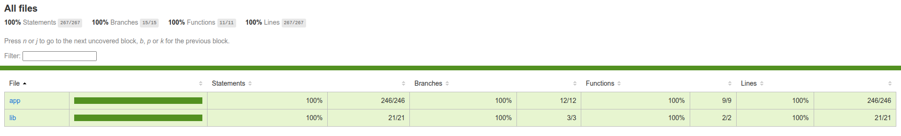

# TDW 1st Mini-Project - Gabriel Teixeira

## Project Status

[](https://github.com/GabrielTeixei/tdw-mp1-Gabriel-Teixeira/actions/workflows/ci-cd.yml)

[](https://tdw-mp1-gabriel-teixeira.tdw-mctw.pt/)

**Deploy:** [Access Project](https://tdw-mp1-gabriel-teixeira.tdw-mctw.pt/)

---

## About the Project

Static blog developed with **Next.js** and **Contentful CMS**, focusing on:

- Static page generation (SSG)
- Integration with Contentful for dynamic content management
- Automatic CI/CD with GitHub Actions
- Continuous deployment on Netlify
- Responsive design and clean code following best practices


---

## Features

- Article listing on the home page with pagination
- Individual post viewing
- Content managed via headless CMS (Contentful)
- Automatic image optimization
- Responsive layout for desktop, tablet, and mobile

---

## Technologies Used

| Category | Technology | Description |
|----------|------------|------------|
| Framework | [Next.js 14](https://nextjs.org/) | React framework for high-performance static page generation. |
| Language  | [TypeScript](https://www.typescriptlang.org/) | Static typing for safer and more readable code. |
| CMS       | [Contentful](https://www.contentful.com/) | Headless CMS for managing content via API. |
| CI/CD     | [GitHub Actions](https://github.com/features/actions) | Automates tests, builds, and continuous deployment. |
| Deploy    | [Netlify](https://www.netlify.com/) | Hosting and continuous deployment integrated with GitHub. |
| Styles    | [Tailwind CSS](https://tailwindcss.com/) | Utility-first CSS framework for fast, responsive layouts. |
| Quality   | [ESLint](https://eslint.org/) + [Prettier](https://prettier.io/) | Code standardization and automatic formatting. |
| Testing   | [Jest](https://jestjs.io/) | Framework for automated tests. |

---

## Running Tests

All unit, integration, and snapshot tests can be run with:

```bash
npm test
```

## Run Coverage



To open the coverage report in your browser:

```bash
xdg-open coverage/lcov-report/index.html


```bash
xdg-open coverage/lcov-report/index.html
```

## Licença

MIT License  
© 2025 Gabriel Teixeira  
See the [LICENSE](LICENSE) file for more details.

